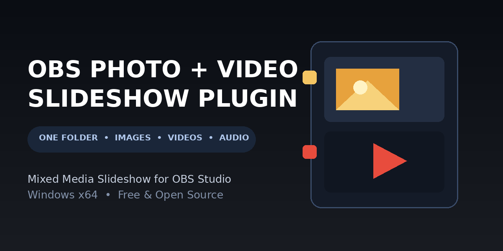

# Mixed Media Slideshow for OBS Studio



**Play photos, church reels, Shorts, and announcement graphics from one OBS folder slideshow—with video audio included.**

[Download the latest Windows release](https://github.com/sydnorlabs/mixed-media-slideshow/releases/latest)

## The problem it solves

OBS Studio’s built-in Slideshow source plays photos, but it cannot play video files from the same folder. I needed a livestream slideshow that could show church reels and Shorts alongside church announcement graphics. ProPresenter can play a mixed-media presentation, but during worship it is needed for lyrics and cannot also keep the livestream slideshow running.

Mixed Media Slideshow lets OBS take over with one dependable folder-based source. It combines images and videos, keeps videos’ audio, and continues the livestream slideshow during prayer, transitions, pre-service, and other moments when ProPresenter is handling worship lyrics.

## Key features

- One folder for photos, videos, reels, Shorts, and announcement graphics.
- Configurable photo duration; videos play to completion with audio.
- Alphabetical, date, or Shuffle playback with loop support.
- Cut, Fade, directional Swipe/Slide, and Fade to Black transitions.
- Proportional Fit + Center sizing with an opaque black matte—no stretching, unwanted crop, or background bleed-through.
- Standard OBS media controls plus source-level Playback Status for the current item and next queued file.
- Safe folder refresh and resilient skipping of unsupported, missing, corrupt, or decoder-rejected files.

## Install on Windows

1. Exit OBS Studio 32.2.1.
2. Use a ZIP produced by the Windows CI build. Do not use a source archive.
3. Confirm the ZIP contains one top-level folder named
   `mixed-media-slideshow`, with:
   - `bin/64bit/mixed-media-slideshow.dll`
   - `data/locale/en-US.ini`
4. Extract that top-level folder into OBS's official all-users plugin directory,
   `C:\ProgramData\obs-studio\plugins\`. Keep the existing `bin` and `data`
   folders together under the plugin root. The DLL should therefore end up at
   `C:\ProgramData\obs-studio\plugins\mixed-media-slideshow\bin\64bit\mixed-media-slideshow.dll`,
   and the locale file at
   `C:\ProgramData\obs-studio\plugins\mixed-media-slideshow\data\locale\en-US.ini`.
   (`ProgramData` is hidden by default; paste the path into File Explorer.)
5. Start OBS. If the source is absent, check **Help > Log Files > View Current
   Log** for a loader error. Do not disable OBS security or modify global OBS
   settings.

## Use

Add **Mixed Media Slideshow** from the Sources `+` menu and select a folder.
Only files directly in that folder are used; subfolders are not traversed.
Choose alphabetical, date (oldest first), or shuffle order, loop behavior, and
a Cut, Fade, directional Swipe/Slide, or Fade to Black transition. Photos and
videos both use proportional Fit + Center sizing inside a source frame fixed to
OBS's current base canvas size. Every pixel remains visible without stretching
or cropping; an opaque black matte fills any unused letterbox/pillarbox area so
underlying scene content cannot show through.

Each shuffle cycle contains every supported item exactly once. Videos are kept
apart within and between cycles whenever images are available as separators.
If there are more videos than the image gaps can separate, the scheduler uses
the mathematically fewest unavoidable adjacent-video pairs. Loop starts a new
full cycle; Shuffle creates a new safe permutation for that cycle. The source
checks the folder once per second. An unchanged scan does not reshuffle or
replay anything. A changed folder retains the current path when possible and,
in Shuffle, rebuilds only the unplayed remainder. Unsupported, missing,
corrupt, or decoder-rejected items are skipped without blocking later items.

Use the standard OBS media toolbar for previous, next, restart, play/pause, and
stop. Its timeline shows real elapsed/duration values for both stills and
videos and can seek the current still or a seekable video. The same controls
are buttons in Source Properties. The read-only **Playback Status** group in
Properties shows the current cycle position, current filename, and next queued
filename. At a Shuffle cycle end it reports that the next cycle is pending
because the new permutation is not realized until the boundary is crossed.

OBS 32.2.1's public source API provides timeline callbacks but no supported way
for a plugin to add arbitrary playlist text such as `5 / 11` to the stock media
control strip. The status therefore stays in plugin-owned Properties; the
plugin does not use private Qt UI injection and draws no dashboard into program
video or audio. Still-image timing pauses with playback; videos use OBS's
FFmpeg media source and retain audio.
Private video audio is forwarded only through the parent slideshow source; its
video-only internal
transition is not exposed as a second scene audio route. Private media sources
leave hardware decoding disabled, matching OBS 32.2.1's compatible software
decode default rather than forcing a CUDA probe.
“Restart on activation” intentionally begins a new full cycle whenever its
scene becomes active after the first activation (the first alphabetical/date
item, or a newly generated safe Shuffle cycle). When disabled, activation does
not change the retained playback state. The explicit Restart media control
continues to restart only the current item.

## Build and test

The project follows the official OBS plugin-template bootstrap layout and pins
OBS sources to tag 32.2.1 plus verified dependency hashes in `buildspec.json`.
On Windows with Visual Studio 2022 and CMake 3.28+:

```powershell
cmake --preset windows-x64
cmake --build --preset windows-x64 --config Release
ctest --preset windows-x64
cmake --install build_x64 --config Release --prefix release
```

On Linux, the OBS-independent library tests need only a C++17 compiler:

```sh
g++ -std=c++17 -Wall -Wextra -Werror -Isrc \
  tests/media-library-tests.cpp src/media-library.cpp -o /tmp/mms-tests
/tmp/mms-tests
```

The GitHub Actions workflow is the authoritative Windows x64 build and rejects
an incorrectly shaped archive or a non-x64 PE DLL before upload.
